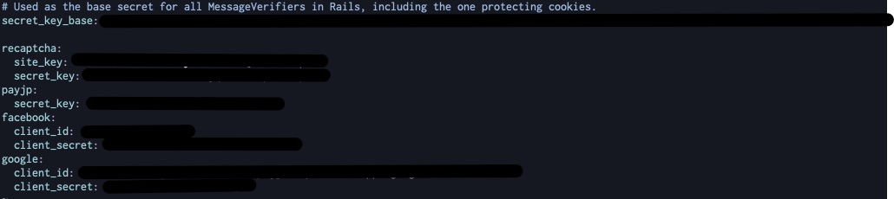
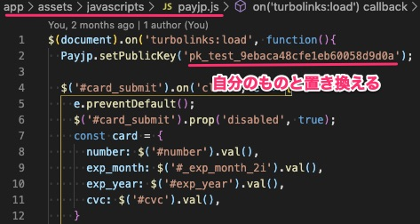

# これは何？
メルカリのユーザー登録機能＆クレカ登録機能だけを実装したミニアプリ

# 導入
```
git clone https://github.com/KazYam1001/mini_sns.git
cd mini_sns
bundle
rails db:create
rails db:migrate

EDITOR='vim' rails credentials:edit
```
APIキーなどを自身のものと置き換える。

credentials.yml編集時は以下の構造で値を入れる。



payjp.jsも公開キーを自分のものと置き換える。



# どう使うの？
ユーザー登録機能(SNS認証、sessionを使ったデータ保持)のコードの見本

実際に動かしてみて挙動を掴む

# できること
- Facebook認証、Google認証
  - Userモデル,Profileモデル,SnsCredentialモデル,users/omniauth_callbacks_controller
- sessionを使ったユーザー登録
  - users/registrations_controller
  - ユーザー登録時にバリデーション付きのrecaptcha
- payjpを使ったクレカ登録機能
  - Cardモデル,cards_controller,payjp.js
  - cards#new で直前のアクションを判定しビューを切り替える機能
